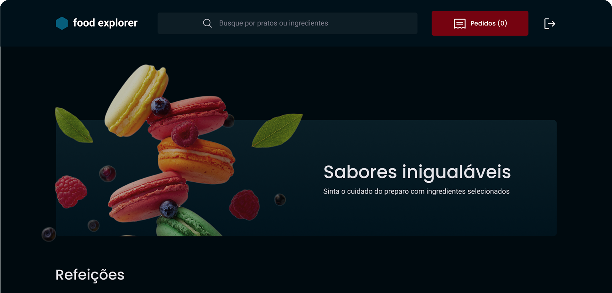

<h1 align="center"> FoodExplorer </h1>

  <a href="#-projeto">Projeto</a>&nbsp;&nbsp;&nbsp;|&nbsp;&nbsp;&nbsp;
  <a href="#-paginasxx\">Páginas</a>&nbsp;&nbsp;&nbsp;|&nbsp;&nbsp;&nbsp;
  <a href="#-tecnologias">Tecnologias</a>&nbsp;&nbsp;&nbsp;|&nbsp;&nbsp;&nbsp;
  <a href="#-funcionalidades">Funcionalidades</a>&nbsp;&nbsp;&nbsp;|&nbsp;&nbsp;&nbsp;
  <a href="#-personas">Personas</a>&nbsp;&nbsp;&nbsp;&nbsp;&nbsp;&nbsp;

##  📌  Projeto

O **Food Explorer** é uma aplicação web onde os usuários podem explorar um catálogo de pratos, visualizar detalhes, e realizar pedidos através de sua conta pessoal.

Com um sistema de autenticação, cada usuário pode se cadastrar, fazer login e adicionar alimentos ao carrinho para compra. A aplicação é totalmente responsiva e pensada para facilitar a experiência gastronômica digital.

## Páginas

- Login
- Cadastro
- Home
- Detalhes do prato
- Novo prato
- Editar prato

## 🚀 Tecnologias

Esse projeto foi desenvolvido com as seguintes tecnologias:

- Styled Components
- React Responsive
- React Router Dom
- React Icons
- ReactDOM
- ReactJS
- ViteJS
- Axios
- Swiper

## 📘 Funcionalidades

- Login
- Criar conta
- Cadastrar pratos
- Mostar detalhes do prato
- Adicionar prato ao carrinho
- Editar prato
- Excluir prato
- Logout

## 👤 Personas 

Temos dois tipos usários o administrador e o usuário comum.

Login: admin@email.com
senha: admin123

Login: user@email.com
senha: user123

##

Feito 🤎 by Jhoni Mattos

- 🤝 [LinkedIn](https://www.linkedin.com/in/jhoni-mattos-7a13852b0/)
- ✉️ E-mail: jhoni.psy@gmail.com

